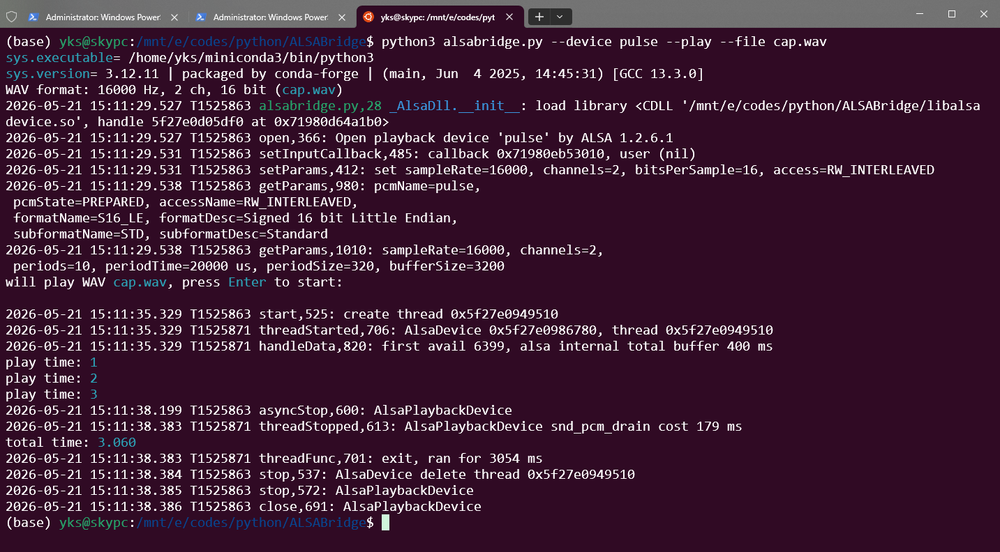

# ALSABridge

在 Linux 上通过 Python 使用 ALSA 进行录音与播放。

ALSA 概念入门（`hw`/`plughw`、采集独占、多 App 共享、本项目用到的全部 ALSA API）见：[docs/alsa-tutorial.md](docs/alsa-tutorial.md)。

项目由两层组成：

| 层级 | 名称 | 说明 |
|------|------|------|
| Python 桥接 | **ALSABridge**（`alsabridge.py`） | 对外提供 Python API，通过 ctypes 调用底层库 |
| C++ 设备库 | **ALSADevice**（`libalsadevice.so`） | 封装 ALSA 设备打开、采播、音量等操作 |

## 项目结构

| 文件 / 目录 | 说明 |
|-------------|------|
| `alsabridge.py` | Python 桥接层 |
| `alsadevice.cpp` / `alsadevice.h` | C++ ALSA 设备实现 |
| `libalsadevice.so` | 编译生成的动态库，需与 `alsabridge.py` 放在同一目录 |
| `log_util.py` | 日志与终端颜色输出 |
| `main.cpp` | C++ 测试 / 演示程序 |
| `Makefile` | 编译脚本 |

## 依赖安装（Debian / Ubuntu / WSL2）

```bash
sudo apt update
sudo apt install -y \
  build-essential \
  make \
  libasound2 \
  libasound-dev \
  python3
```

## WSL2 音频配置

WSL2 本身没有物理声卡，系统音频由 **WSLg** 通过 **PulseAudio**（`unix:/mnt/wslg/PulseServer`）转发到 Windows。
VLC 等播放器往往直接用 Pulse，而 ALSABridge 走 ALSA，需要把 ALSA 的 `default` 接到 Pulse，否则会报 `Unknown PCM default` / `cannot find card '0'`。

### 1. 安装 ALSA Pulse 插件（WSL2 额外依赖）

在完成上方「依赖安装」后，再执行：

```bash
sudo apt install -y libasound2-plugins alsa-utils
```

| 包名 | 用途 |
|------|------|
| `libasound2-plugins` | 提供 `pulse`、`default` 等 PCM，将 ALSA 接到 WSLg 的 PulseAudio |
| `alsa-utils` | `aplay` / `arecord` 等，用于检查设备列表 |

### 2. 配置 `~/.asoundrc`

将 ALSA 的默认设备指向 Pulse：

```bash
cat > ~/.asoundrc << 'EOF'
pcm.!default {
    type pulse
}
ctl.!default {
    type pulse
}
EOF
```

### 3. 设置 Pulse 服务地址（可选）

WSLg 通常已自动配置；若 `pactl info` 里 Server String 为 `unix:/mnt/wslg/PulseServer`，可写入 shell 配置：

```bash
echo 'export PULSE_SERVER=unix:/mnt/wslg/PulseServer' >> ~/.bashrc
source ~/.bashrc
```

### 4. 验证

```bash
# Pulse 是否在运行
pactl info

# 应能看到 pulse、default（而不只有 null）
aplay -L
arecord -L

# 列出设备
python3 alsabridge.py -i
python3 alsabridge.py -o
```

`aplay -L` / `arecord -L` 正常时大致类似：

```
pulse
    PulseAudio Sound Server
default
```

也可显式指定 Pulse 设备：

```bash
python3 alsabridge.py -c -f capture.wav -d pulse
python3 alsabridge.py -p -f capture.wav -d pulse
```

### 5. 录音说明

WSLg 下默认麦克风常为 **RDPSource**（Windows 侧输入），配置完成后录音与播放均经 Pulse 与 Windows 音频互通。

## 编译

在项目根目录执行：

```bash
# 生成 libalsadevice.so（供 Python 加载）
make buildso
```

修改 `alsadevice.cpp` / `alsadevice.h` 后必须重新 `make buildso`，否则 Python 可能报 `queryAlsaDeviceHwParams not exported` 等符号缺失。

## Python 使用

### 命令行

```bash
# 列出录音设备
python3 alsabridge.py -i

# 列出播放设备
python3 alsabridge.py -o

# 列出设备并查询硬件支持的声道 / 采样率 / 格式（需匹配后才能直接用 hw:）
python3 alsabridge.py -o --verbose
python3 alsabridge.py -i --verbose

# 录音到 WAV（默认 cap.wav，16 kHz、双声道、16 bit）
python3 alsabridge.py -c -f cap.wav -s 16000 -n 2 -b 16

# 播放 WAV（采样率、声道、位深从文件头读取，无需再传 -s -n -b）
python3 alsabridge.py -p -f cap.wav

# 指定硬件设备播放（格式须为该设备原生支持；否则可用 plughw: 做转换）
python3 alsabridge.py -p -d "hw:Device_1,0" -f cap.wav
python3 alsabridge.py -p -d "plughw:Device_1,0" -f cap.wav

# WSL2 上指定 Pulse 设备播放（需先完成上文「WSL2 音频配置」）
python3 alsabridge.py -d pulse -p -f cap.wav
```

`--verbose` 输出示例：

```text
AudioDevice(card_id="default", device_name="default", device_id="default")
  resolves: hw:rockchipes8388,0
  card    : hw:2 (rockchip-es8388)
  type    : HW
  channels: 2
  rates   : 8000-48000
  formats : S16_LE, S32_LE
AudioDevice(card_id="hw:4", device_name="USB Composite Device, USB Audio", device_id="hw:Device_1,0")
  resolves: hw:Device_1,0
  card    : hw:4 (USB Composite Device)
  type    : HW
  channels: 2
  rates   : 8000-48000
  formats : S16_LE, S32_LE
```

`resolves` 表示该 `device_id` 打开后实际落到的硬件 PCM；若经 Pulse 等逻辑插件且拿不到声卡号，会显示 `logical, no hw card`。

### 播放示例（WSL2）

先录音生成 `cap.wav`（或使用已有 WAV），再播放，运行后按提示按 Enter 开始；播完会自动停止并打印总时长。输出如下：



常用参数：

| 参数 | 含义 |
|------|------|
| `-d` / `--device-id` | 设备 ID，默认 `default` |
| `-f` / `--file` | WAV 文件路径，默认 `cap.wav` |
| `-v` / `--volume` | 音量 0–100。播放：默认软件增益（只影响本路 PCM，不改系统混音器）；录音：按 `-d` 解析到的声卡设置 ALSA mixer |
| `--verbose` | 仅长选项；与 `-i` / `-o` 联用时查询并打印各设备解析结果与硬件参数（resolves/card/type/声道/采样率/格式） |

`hw:` 直连硬件，参数必须原生支持；格式不匹配时可改用 `plughw:`（ALSA 自动转换，略有开销）。

音量说明：

| 场景 | 行为 |
|------|------|
| 播放 `-v 50` | 软件音量（缩放 PCM），不改系统音量 |
| 播放模块 `set_volume(50, card_id='hw:4')` | 改指定卡的 ALSA mixer |
| 录音 `-v 50 -d hw:Device_1,0` | 解析设备所在卡后设置该卡 capture mixer |

仅 **录音**（`-c`）时有效（播放时从 WAV 读取，传入会被忽略并提示）：

| 参数 | 含义 |
|------|------|
| `-s` / `--sample-rate` | 采样率，默认 16000 |
| `-n` / `--channels` | 声道数，默认 2 |
| `-b` / `--bits-per-sample` | 位深，默认 16 |

### 作为模块导入

```python
from alsabridge import (
    get_capture_devices,
    get_playback_devices,
    query_device_hw_params,
    AlsaCaptureDevice,
    AlsaPlaybackDevice,
)

for dev in get_capture_devices():
    print(dev)
    print(query_device_hw_params(dev.device_id, is_capture=True))

# Playback volume:
#   set_volume(50)                 -> software gain (default)
#   set_volume(50, card_id='hw:4') -> ALSA mixer on that card
# Capture volume always uses mixer:
#   set_volume(50, card_id='hw:2')
```
